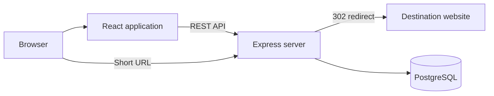

# Linkora

Linkora is a full-stack URL shortener with secure account management, editable
short links, QR codes, expiry controls, bulk CSV creation, and privacy-aware
analytics.

> The project is under active development for the Katomaran full-stack
> hackathon.

## Planned Features

- Secure signup, login, logout, and protected account routes
- Unique generated codes and validated custom aliases
- Server-side redirects and click tracking
- Link dashboard with copy, edit, delete, search, sort, and pagination
- Visit history, daily charts, browser, device, and approximate location data
- QR downloads, expiry dates, and owner-controlled public statistics
- Bulk CSV shortening with row-level validation
- Responsive Rebrandly-inspired interface using an original white-first design

## Technology

- React 19 and Vite
- Node.js 22 and Express 5
- PostgreSQL and Prisma
- Vitest, Testing Library, Supertest, and Playwright
- Render and Neon

## Local Setup

1. Install Node.js 22.
2. Install dependencies with `npm install`.
3. Copy `.env.example` to `.env` and replace all placeholder secrets.
4. Start both applications with `npm run dev`.
5. Open `http://localhost:5173`.

## Commands

| Command | Purpose |
| --- | --- |
| `npm run dev` | Run the React and API development servers |
| `npm test` | Run client and server tests |
| `npm run lint` | Run static code checks |
| `npm run build` | Build the production React application |
| `npm run check` | Run linting, tests, and the production build |

## Environment

See `.env.example`. Secrets must never be committed. Production requires HTTPS,
a managed PostgreSQL connection, and independent high-entropy session and
analytics hashing secrets.

## Architecture

The production Express service serves the compiled React application and API
from one origin. Redirect handling and analytics remain server-side.

## Security

Development follows the OWASP Top 10:2025 and uses OWASP ASVS 5.0 Level 1 as a
verification baseline. See [docs/SECURITY.md](docs/SECURITY.md) for the evolving
threat model and control matrix.

## Assumptions

- Public statistics are private by default.
- Approximate location analytics do not retain raw IP addresses.
- Expired links return a branded HTTP 410 response.
- Custom aliases cannot be changed after creation.
- All stored timestamps use UTC and are displayed in the viewer's timezone.

## AI Planning

The implementation plan and module history are documented in
[docs/AI_PLANNING.md](docs/AI_PLANNING.md).

## Demo Video

The Loom or YouTube demonstration URL will be added before submission.

This project is a part of a hackathon run by https://katomaran.com

