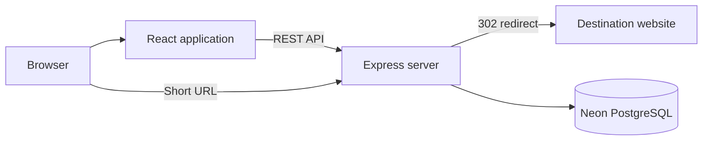

# Linkora

Linkora is a secure full-stack URL shortener with a polished white-first
interface, custom links, privacy-aware analytics, QR codes, expiry controls,
public reports, editable destinations, and idempotent CSV imports.

## Live Demo And Video

- **Live application:** Add the final Render URL here.
- **Loom/YouTube walkthrough:** Required before submission. Add the public URL
  here.

## Features

- Account signup, login, logout, session restoration, and protected routes
- Strict per-user ownership for link management and private analytics
- Generated short codes and normalized custom aliases
- HTTP(S) destination validation and server-side HTTP 302 redirects
- Searchable, sortable, responsive link dashboard with copy and delete actions
- Click count, last visit, recent history, daily trends, device, browser, and
  approximate country analytics
- Editable destinations, future expiry, branded `410` handling, and QR download
- Owner-controlled aggregate public statistics
- CSV validation preview and retry-safe partial processing for up to 100 rows
- Loading, empty, success, validation, retry, and error states
- Rebrandly-inspired original design using `#5D1C6A`, `#CA5995`, `#FFB090`, and
  `#FFF1D3` over white surfaces

## Technology

- React 19, Vite, React Router, Recharts, and Lucide
- Node.js 22, Express 5, Zod, and Prisma
- PostgreSQL on Neon
- Vitest, Testing Library, and Supertest
- Render, GitHub Actions, CodeQL, Dependabot, and OWASP ZAP

## Local Setup

1. Install Node.js 22 and PostgreSQL.
2. Run `npm install`.
3. Copy `.env.example` to `.env` and replace every placeholder.
4. Create the database and run `npm run db:migrate`.
5. Optionally configure the demo variables and run `npm run db:seed`.
6. Start both applications with `npm run dev`.
7. Open `http://localhost:5173`.

## Commands

| Command | Purpose |
| --- | --- |
| `npm run dev` | Run React and Express development servers |
| `npm run check` | Run linting, tests, and production build |
| `npm run security:check` | Audit dependencies and run server security tests |
| `npm run db:generate` | Generate Prisma Client |
| `npm run db:migrate` | Create/apply a development migration |
| `npm run db:deploy` | Apply committed production migrations |
| `npm run db:seed` | Create optional demonstration data |
| `npm start` | Start the production Express server |

## Architecture

Express serves the compiled React application and REST API from one production
origin. Redirect handling and analytics collection remain server-side.

## Documentation

- [AI planning and module workflow](docs/AI_PLANNING.md)
- [Architecture details](docs/architecture.md)
- [REST API](docs/API.md)
- [Security threat model and review log](docs/SECURITY.md)
- [OWASP ASVS verification checklist](docs/ASVS_CHECKLIST.md)
- [Render and Neon deployment](docs/DEPLOYMENT.md)
- [Video and evidence checklist](docs/DEMO_SCRIPT.md)

## Security Summary

Linkora targets OWASP ASVS 5.0 Level 1 and applicable OWASP Top 10:2025 risks.
It uses bcrypt password hashing, database-backed revocable sessions, secure
cookies, origin checks, strict validation, ownership-scoped database queries,
rate limits, CSP/security headers, privacy-scoped analytics identifiers,
bounded CSV parsing, dependency audits, CodeQL, and a deploy-time ZAP workflow.

Security testing reduces known risk but is not a guarantee of absolute
invulnerability. Critical and high findings block release.

## Assumptions

- Public statistics are private by default and contain aggregate data only.
- Raw IP addresses are never retained.
- Country analytics require a trusted edge to overwrite geolocation headers.
- Custom aliases are immutable; destination URLs remain editable.
- Timestamps are stored in UTC and displayed in the viewer's timezone.
- Render cold starts are acceptable for the free live-demo deployment.

## AI Workflow

AI assistance was used for planning, implementation, test generation, security
review, and documentation. Each module was inspected, tested, committed
separately, and designed to be explainable during the interview.

This project is a part of a hackathon run by https://katomaran.com
