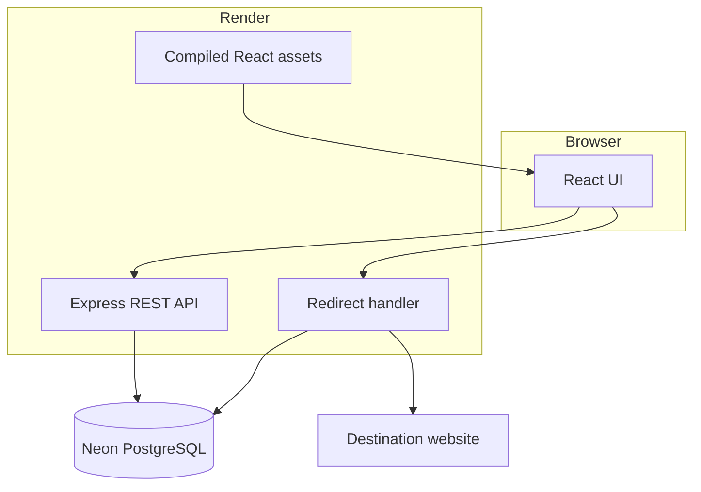

# Architecture

Linkora uses a React single-page application and an Express REST API. In
production, Express serves the compiled client to keep browser and API requests
on one origin.

The database stores users, links, and visits. Redirect requests resolve the
short code, enforce expiry, record privacy-aware analytics, and return an HTTP
302 response.
